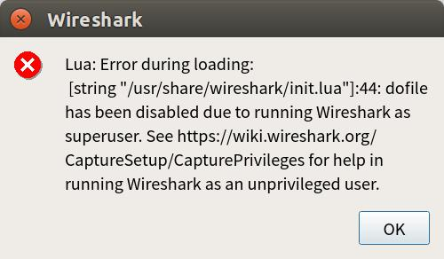

# 关于在Linux环境下开启Wireshark，提示无法读取init.lua的解决方法
## 问题描述
详细信息：Lua error during loading:[string "/usr/share/wireshark/init.lua"]:45 dofile has been disabled
 
如图所示： 

## 解决方案
以管理员权限打开此文件（假定已经切换至此文件夹）：sudo gedit init.lua。
 
修改倒数第二行的：dofile("console.lua")为：--dofile("console.lua")。 
修改光标所指的地方： 

# 关于官方文档中“打开Mininet并加载自定义的网络拓扑时，找不到自定义拓扑的错误”
## 问题描述
[官方文档](http://mininet.org/walkthrough/)中指出：可用以下命令来调用Mininet提供的一个自定义拓扑文件： 
> $ sudo mn --custom ~/mininet/custom/topo-2sw-2host.py --topo mytopo --test pingall

会提示找不到自定义拓扑文件，如图所示： 
 

## 解决方案
参考mininet/custom文件夹中的readme.md中的说明：
> To start up a mininet with the provided custom topology, do:
   sudo mn --custom custom_example.py --topo mytopo

如图所示： 
